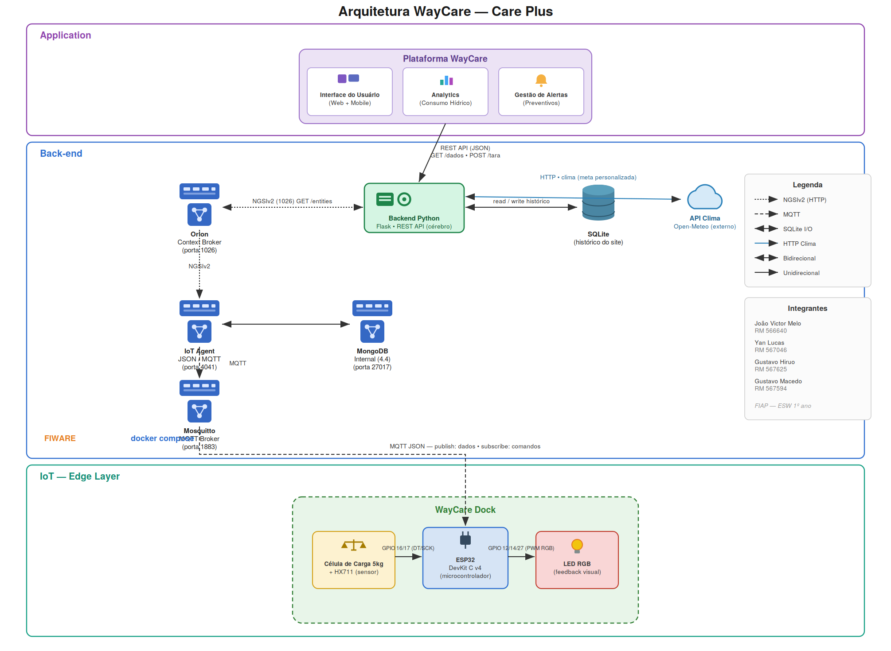

# WayCare Dock — Edge Computing & IoT
### Challenge Care Plus | FIAP — 1º ano Engenharia de Software | Sprint 3

---

## Descrição do Projeto

O **WayCare Dock** é um suporte inteligente para garrafa d'água que monitora o
consumo de hidratação do usuário em tempo real. O ESP32 lê uma célula de carga e
publica o peso via MQTT; um **backend Python na nuvem** calcula o consumo, a meta
diária personalizada e a gamificação, grava o histórico em **SQLite** e serve uma
**API REST** para o site da plataforma WayCare. A tara é acionada pelo site.

---

## Como a Dock Funciona (passo a passo)

### 1. Configuração inicial (uma vez)
A pessoa coloca a **garrafa vazia** na dock e aciona a **tara pelo site**. Isso
zera a balança com a garrafa vazia em cima — ou seja, o "zero" do sistema passa a
ser "garrafa vazia presente". A partir daí, todo peso positivo representa a
**água dentro da garrafa**, e não precisa configurar de novo (só ao trocar de
garrafa).

### 2. Abastecer
A pessoa enche a garrafa. O peso sobe (ex: +900 g = 900 ml de água). O sistema
reconhece como **abastecimento** (peso subiu) e não conta como consumo.

### 3. Beber
A pessoa pega a garrafa, bebe e recoloca na dock. O peso estável cai (ex: de 900
para 800). Essa **queda de 100 g vira 100 ml de consumo** registrado. O consumo do
dia acumula, e o progresso em relação à meta é atualizado.

### 4. Garrafa fora da base
Como a tara foi feita com a garrafa vazia, **remover a garrafa deixa o peso
negativo** (abaixo de –20 g). Esse é o sinal de "garrafa fora": enquanto ela está
fora, o sistema não registra consumo nem dispara alertas — ele não tem como medir
o que acontece fora da dock. Quando a garrafa volta com menos água, a diferença é
contabilizada como o que foi bebido.

### 5. Bebeu tudo
Se a pessoa beber toda a água, o peso volta a **~0 g com a garrafa vazia ainda na
dock** — e isso é corretamente entendido como "garrafa vazia presente" (não como
garrafa removida, que seria negativo). O consumo é contabilizado até o fim.

### 6. Filtro de ruído (estabilização)
A célula de carga tem ruído natural (varia ~1 g mesmo parada). Por isso o ESP32:
- considera o peso **estável** quando a variação fica dentro de ±8 g;
- só aceita como leitura válida depois de **3 segundos** estável;
- publica a **mediana** das leituras desse período (valor limpo, imune ao ruído);
- só envia um novo peso quando ele muda **≥10 g** do último publicado.

Resultado: pequenas oscilações não geram leituras falsas; só mudanças reais
(beber/abastecer) são registradas.

### 7. Divisão edge × nuvem
O ESP32 (**edge**) faz só o que exige o sensor em tempo real: estabilizar e
publicar o peso, e executar comandos (tara/LED). Todo o **cálculo** (consumo, %,
fatias, streak, meta, decisão da cor do LED) acontece no **backend Python na
nuvem**, que devolve os comandos ao ESP32 e serve a API ao site.

---

## Estados do LED RGB

A cor do LED é **decidida pelo backend** (com base no consumo e na meta) e enviada
ao ESP32 por comando MQTT. O backend reenvia a cor periodicamente, garantindo que
o LED sempre reflita o estado real.

| Cor | Significado |
|-----|-------------|
| 🟢 Verde | Hidratação em dia — tudo certo |
| 🔴 Vermelho | Mais de 1 hora sem beber (com a garrafa presente na dock) |
| 🟢 Verde pulsando | Meta diária atingida (100%) |
| 🔵 Azul | Estado transitório: inicialização (boot) e durante a tara |

> O vermelho **só** dispara com a garrafa presente. Se a garrafa está fora da
> dock, o sistema fica neutro — ele não acusa "sem beber" porque não tem como
> saber o que acontece com a garrafa fora da base.

> **LED ânodo vs cátodo comum:** o firmware do hardware real está configurado para
> **cátodo comum** (pino COM no GND). Para LED de ânodo comum, inverter o PWM na
> função `setRGB()` (usar `255 - valor`).

---

## Arquitetura



- **Edge (ESP32):** estabiliza o peso (mediana da janela), publica só na mudança,
  executa tara/LED. Não calcula consumo.
- **Nuvem (Python/Flask):** lê o peso do Orion, máquina de estado do consumo,
  gamificação, meta personalizada, histórico em SQLite, API REST e comandos MQTT.
- **FIWARE (Docker):** Orion Context Broker + IoT Agent JSON + Mosquitto + MongoDB.

### O que mudou nesta sprint (vs. Sprint 2)
- Arquitetura **híbrida edge–nuvem**: o ESP32 não calcula mais consumo.
- **Backend Python** (Flask + MQTT + SQLite) com toda a lógica de negócio.
- **SQLite** no lugar do MongoDB para o histórico que o site consome.
- **Tara pelo site** (botão físico removido).
- **Meta personalizada** por peso, sexo, atividade (ACSM) e temperatura (Open-Meteo).
- **Garrafa fora** detectada por peso negativo.
- **Deploy com HTTPS** (nginx + DuckDNS + Let's Encrypt).

---

## Estrutura do Repositório

```
waycare-edge/
├── README.md
├── DEPLOY.md                    <- passo a passo completo de instalacao
├── firmware/
│   ├── waycare_dock_wokwi.ino   <- versao para simulacao no Wokwi
│   ├── waycare_dock_real.ino    <- versao para o hardware real (calibrado)
│   ├── waycare_calibracao.ino   <- sketch de calibracao (rodar 1x)
│   ├── diagram.json             <- circuito do Wokwi
│   └── libraries.txt
├── backend/
│   ├── waycare_python.py        <- Flask + MQTT + SQLite + logica de consumo/meta
│   ├── requirements.txt
│   └── waycare-python.service   <- servico systemd
├── fiware/
│   └── docker-compose.yml       <- Orion + IoT Agent + Mosquitto + MongoDB
├── infra/
│   └── waycare-nginx.conf       <- proxy reverso HTTPS (nginx + DuckDNS)
├── postman/
│   ├── WayCare_Fiware_Sprint3.postman_collection.json
│   └── WayCare_Fiware_Sprint2.postman_collection.json
└── docs/
    ├── WayCare_API.md           <- contrato da API REST (para o front-end)
    └── WayCare_Arquitetura_v99.drawio.png
```

> O **site (front-end)** fica em repositorio separado e consome a API descrita em
> `docs/WayCare_API.md`.

---

## Circuito (pinagem ESP32)

| Componente | Pino ESP32 | Função |
|------------|-----------|--------|
| HX711 — DT | GPIO 16 | Dados da célula de carga |
| HX711 — SCK | GPIO 17 | Clock |
| HX711 — VCC | 3V3 | Alimentação |
| HX711 — GND | GND | Terra (comum a tudo) |
| Célula de carga | E+/E-/A+/A- (no HX711) | Sensor de peso |
| LED RGB — R / G / B | GPIO 12 / 14 / 27 | Feedback visual |
| LED RGB — COM | GND | Comum (cátodo comum) |

> Calibração: rodar `waycare_calibracao.ino` uma vez com um peso conhecido para
> obter o `HX_SCALE_FACTOR` e colá-lo no `waycare_dock_real.ino`.

---

## Como Executar

Passo a passo detalhado em **DEPLOY.md**. Resumo:

1. **FIWARE:** `cd fiware && docker compose up -d`
2. **Provisionar:** importar `postman/WayCare_Fiware_Sprint3...json` e rodar (1x).
3. **Backend:** `pip3 install -r backend/requirements.txt --break-system-packages`
   e instalar o servico systemd.
4. **HTTPS:** nginx + DuckDNS + certbot (`infra/waycare-nginx.conf`).
5. **Firmware:** calibrar, colar o fator, preencher WiFi e subir (real ou Wokwi).
6. **Perfil:** definir peso/sexo/atividade/cidade (define a meta).

---

## Base científica da meta

- **Base por peso/sexo:** ml/kg clínico (35 m / 31 f), ordem de grandeza da EFSA
  (2,5 L homem / 2,0 L mulher/dia, em clima e atividade moderados).
- **Temperatura:** ajuste acima de 25°C, com teto de +500 ml (estimativa
  transparente — não há constante científica de "ml por grau").
- **Atividade:** baseada na ACSM (0,4–0,8 L/h de exercício): leve +350, moderado
  +700, intenso +1200 ml.
- É uma **estimativa / meta sugerida**, não prescrição médica.

---

## Integrantes

| Nome | RM |
|------|----|
| João Victor Melo | 566640 |
| Yan Lucas | 567046 |
| Gustavo Hiruo | 567625 |
| Gustavo Macedo | 567594 |
