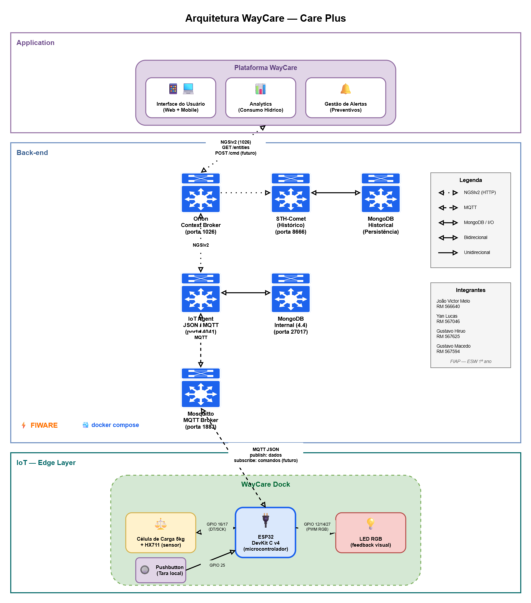

# 💧 WayCare Dock — Edge Computing & IoT
### Challenge Care Plus | FIAP — 1º ano Engenharia de Software | Sprint 2

---

## 📋 Descrição do Projeto

O **WayCare Dock** é um suporte inteligente para garrafa d'água que monitora automaticamente o consumo de hidratação do usuário. Utilizando um ESP32 conectado via MQTT a uma plataforma FIWARE na nuvem, o dispositivo captura dados em tempo real e os disponibiliza para consulta, compondo a camada de Edge Computing do ecossistema WayCare da Care Plus.

Nesta sprint, o hardware foi simulado digitalmente no **Wokwi**, com uma **célula de carga (load cell) de 5kg** lida pelo módulo conversor **HX711** para medir o peso real da garrafa, e um LED RGB fornecendo feedback visual ao usuário sobre seu progresso de hidratação.

---

## 🏗️ Arquitetura da Solução



A arquitetura do projeto **WayCare** baseia-se na plataforma **FIWARE**, integrando dispositivos de borda com serviços de nuvem para monitoramento de saúde:

* **Edge Layer:** Composta pelo ESP32 (simulado no Wokwi), célula de carga + HX711 para medição de peso, LED RGB e Pushbutton.
* **Connectivity:** Comunicação via protocolo **MQTT** através do broker Mosquitto.
* **Backend:** Utiliza o **IoT Agent MQTT** para tradução de mensagens, **Orion Context Broker** para gestão do estado atual e **STH-Comet** para persistência de dados no **MongoDB**.
* **Application:** Plataforma WayCare composta por Interface do Usuário (Web + Mobile), Analytics de consumo hídrico e Gestão de Alertas preventivos.

> 📌 **Nota sobre a arquitetura:** O diagrama representa a **arquitetura completa do produto WayCare**, incluindo funcionalidades previstas para evoluções futuras (como persistência histórica via STH-Comet e comando remoto de tara pela Plataforma WayCare). Na Sprint 2, está implementada a captura e publicação de dados em tempo real do dock para o Orion Context Broker — os elementos restantes representam o estado-alvo do sistema.

---

## ⚙️ Tecnologias Utilizadas

| Camada | Tecnologia |
|--------|-----------|
| Hardware simulado | ESP32 DevKit C v4 (Wokwi) |
| Sensor de peso | Célula de carga 5kg + HX711 (24-bit ADC) |
| Firmware | C++ (Arduino Framework) |
| Bibliotecas | PubSubClient, HX711 (bogde) |
| Protocolo IoT | MQTT |
| Broker MQTT | Eclipse Mosquitto 1.6.14 |
| IoT Agent | FIWARE IoT Agent JSON |
| Context Broker | FIWARE Orion |
| Banco de dados | MongoDB 4.4 |
| Infraestrutura | Docker + Docker Compose |
| Cloud | Microsoft Azure (VM Ubuntu) |

---

## 📁 Estrutura do Repositório

```
waycare-edge/
│
├── firmware/
│   └── waycare_dock_mqtt.ino       # Código-fonte do ESP32
│
├── fiware/
│   └── docker-compose.yml          # Stack completo do FIWARE
│
├── postman/
│   └── WayCare_Fiware_Sprint2.postman_collection.json
│
├── docs/
│   └── waycare.drawio.png          # Diagrama da arquitetura
│
└── README.md
```

---

## 🔩 Componentes do Circuito (Wokwi)

| Componente | Pino ESP32 | Função |
|------------|-----------|--------|
| HX711 — DT (data) | GPIO 16 | Saída de dados da célula de carga |
| HX711 — SCK (clock) | GPIO 17 | Clock de comunicação com o HX711 |
| HX711 — VCC | 3V3 | Alimentação do módulo |
| HX711 — GND | GND | Terra do módulo |
| Célula de carga | E+, E-, A+, A- (HX711) | Sensor de peso (até 5kg) |
| Pushbutton | GPIO 25 | Botão de tara (segurar 2s) |
| LED RGB — R / G / B | GPIO 12 / 14 / 27 | Feedback visual |
| LED RGB — COM | 3V3 (ânodo comum) | Pino comum do LED |

> ⚠️ **Atenção:** o LED RGB do Wokwi é **ânodo comum** (pino COM ligado em 3V3). Por isso o firmware aplica a lógica invertida no PWM (`255 - valor`). Caso utilize um LED de cátodo comum em hardware real, basta remover a inversão na função `setRGB()`.

---

## 💡 Estados do LED RGB

O LED fornece feedback visual em tempo real sobre o estado do sistema:

| Cor | Comportamento | Significado |
|-----|---------------|-------------|
| 🔵 Azul sólido | Aceso | Tarando a balança |
| 🟡 Amarelo | Piscando | Garrafa levantada (no ar) |
| 🔵 Azul fraco | Piscando | Aguardando estabilização do peso |
| 🟢 Verde | Brilho proporcional ao % | Hidratação progredindo durante o dia |
| 🟢 Verde sólido | Aceso por 5s | Fatia da meta atingida (25%, 50%, 75%) |
| 🟢 Verde | Pulsando | 🏆 Meta diária 100% atingida |
| 🔴 Vermelho | Piscando | Sem beber água há mais de 10 minutos |

---

## 🔌 Como Executar

### Pré-requisitos

- Conta no [Wokwi](https://wokwi.com)
- VM Linux com Docker instalado e portas abertas: `22`, `1026`, `1883`, `4041`

---

### 1. Subir o FIWARE na VM

Acesse a VM via SSH e execute:

```bash
cd waycare-fiware
docker compose up -d
```

Verifique se os 4 containers estão rodando:

```bash
docker ps
```

Os containers esperados são: `fiware-orion`, `fiware-iot-agent`, `mosquitto`, `db-mongo`.

---

### 2. Configurar o FIWARE via Postman

Importe o arquivo `postman/WayCare_Fiware_Sprint2.postman_collection.json` no Postman.

Execute os requests nessa ordem:

| Ordem | Request | Resultado esperado |
|-------|---------|-------------------|
| 1 | `Orion → 1. Version` | 200 OK |
| 2 | `IOT Agent → 1.1 Health Check` | 200 OK |
| 3 | `IOT Agent → 2. Provisioning Service Group` | 201 Created |
| 4 | `IOT Agent → 3. Provisioning WayCare Dock Device` | 201 Created |

> Se os passos 3 e 4 retornarem `409 Conflict`, significa que o device já está provisionado — pode prosseguir normalmente.

---

### 3. Executar a Simulação no Wokwi

Acesse o link da simulação pública: **https://wokwi.com/projects/462317954210211841**

Bibliotecas necessárias no `libraries.txt` do Wokwi:

```
PubSubClient
HX711
```

Ajuste de uso:

- **Arraste o slider da célula de carga** (0 a 5kg) para simular o peso da água na garrafa
- **Botão de tara**: segure por 2s para zerar a balança
- Aguarde `💧 CONSUMO CONFIRMADO` aparecer no Serial Monitor após variar o peso
- O ESP32 publicará os dados automaticamente via MQTT

---

### 4. Verificar os dados no Orion

No Postman, execute:

```
Orion → 2. Get all entities
```

Resposta esperada:

```json
{
  "id": "WaycareDock:dock01",
  "type": "WaycareDock",
  "peso": { "value": 1155.6 },
  "consumo": { "value": 608.1 },
  "pct": { "value": 30 },
  "fatias": { "value": 1 },
  "estado_led": { "value": "verde" }
}
```

---

## 📡 Tópico MQTT

| Campo | Valor |
|-------|-------|
| Broker | `IP_DA_VM:1883` |
| Tópico | `/json/waycare2025/dock01/attrs` |
| Formato | JSON |
| API Key | `waycare2025` |
| Device ID | `dock01` |

---

## 🎯 Atributos Monitorados

| Atributo | Tipo | Descrição |
|----------|------|-----------|
| `peso` | Float | Peso atual na dock (gramas, lido pela célula de carga via HX711) |
| `consumo` | Float | Total consumido no dia (ml) |
| `pct` | Float | Percentual da meta diária (%) |
| `fatias` | Integer | Fatias da meta atingidas (0-4) |
| `estado_led` | Text | Cor atual do LED de feedback |

---

## 🔬 Sobre a Leitura de Peso

O módulo **HX711** é um conversor ADC de 24 bits específico para células de carga, que comunica com o ESP32 por dois fios (DT + SCK) em um protocolo serial proprietário. A biblioteca `HX711` (bogde) abstrai esse protocolo e fornece três operações principais utilizadas no firmware:

- `scale.tare(N)` — zera a balança fazendo média de N leituras (usado pelo botão de tara)
- `scale.get_units(N)` — retorna o peso já convertido em gramas
- `scale.set_scale(factor)` — ajusta o fator de calibração

### Calibração no Wokwi

O simulador Wokwi usa apenas ~11 bits de resolução do HX711 (em vez dos 24 bits do hardware real), entregando valor bruto máximo de ~2100 para uma célula de 5kg. Para compensar e obter leitura direta em gramas (0-5000g), utilizamos:

```cpp
#define HX_SCALE_FACTOR  0.42f   // 2100 / 5000 = 0.42
```

Em hardware real, este fator viria da calibração com peso conhecido (geralmente um valor muito maior, na casa das centenas).

### Estabilidade de Leitura

Para suavizar pequenas variações de leitura, o firmware aplica:

- **Média móvel circular** de 20 amostras
- **Cache da última leitura válida** (a HX711 só fornece amostra a ~10Hz, então a maioria dos ciclos do `loop()` precisa repetir o último valor)
- **Janela de estabilização de 3 segundos** antes de confirmar consumo ou abastecimento (evita registrar consumo fantasma quando a garrafa está sendo manuseada)
- **Variação mínima de 20g** para considerar uma mudança relevante

---

## 🎥 Vídeo de Demonstração

**[INSERIR LINK DO YOUTUBE AQUI]**

---

## 👥 Integrantes

| Nome | RM |
|------|----|
| João Victor Melo | 566640 |
| Yan Lucas | 567046 |
| Gustavo Hiruo | 567625 |
| Gustavo Macedo | 567594 |

---

## 🔗 Links

- 🔵 [Simulação Wokwi](https://wokwi.com/projects/462317954210211841)
- 📺 [Vídeo YouTube](INSERIR LINK)
- 📋 [Challenge Care Plus — FIAP](https://www.fiap.com.br)
